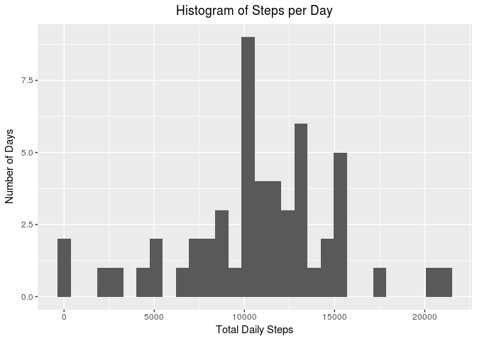
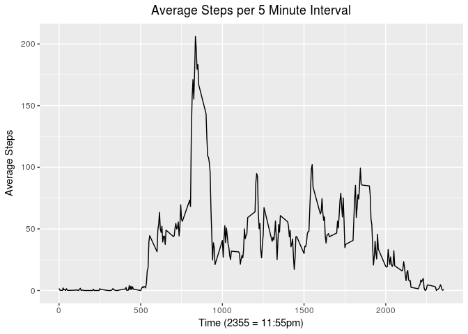
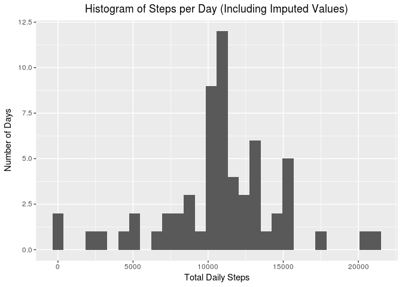
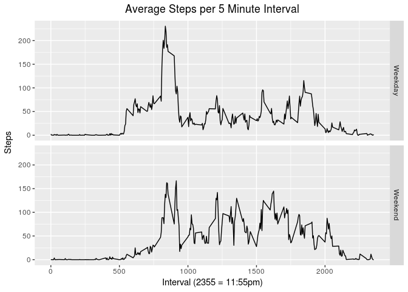

## Loading and preprocessing the data

```r
unzip("activity.zip")
data <- read.csv2("activity.csv", sep = ",", colClasses = c(NA, "Date", "integer"))
```

## What is mean total number of steps taken per day?

```r
library(dplyr)
```

```
## 
## Attaching package: 'dplyr'
```

```
## The following objects are masked from 'package:stats':
## 
##     filter, lag
```

```
## The following objects are masked from 'package:base':
## 
##     intersect, setdiff, setequal, union
```

```r
library(ggplot2)
mdf <- data %>% group_by(date) %>% summarize(steps = sum(steps))
g <- ggplot(data = mdf, aes(steps)) + geom_histogram()
g <- g + labs(title = "Histogram of Steps per Day", y = "Number of Days", x = "Total Daily Steps")
g <- g + theme(plot.title = element_text(hjust = 0.5))
g
```

```
## `stat_bin()` using `bins = 30`. Pick better value with `binwidth`.
```

```
## Warning: Removed 8 rows containing non-finite values (stat_bin).
```

<!-- -->

```r
mean_steps <- mean(mdf$steps, na.rm = TRUE)
median_steps <- median(mdf$steps, na.rm = TRUE)
```
The mean number of daily steps is 10,766.19, and the median number of daily steps is 10,765.

## What is the average daily activity pattern?

```r
interval_steps <- data %>% group_by(interval) %>% summarize(steps = mean(steps, na.rm = TRUE))
g <- ggplot(data = interval_steps, aes(x = interval, y = steps)) + geom_line()
g <- g + labs(title = "Average Steps per 5 Minute Interval", x = "Time (2355 = 11:55pm)", y = "Average Steps")
g <- g + theme(plot.title = element_text(hjust = 0.5))
g
```

<!-- -->

```r
max_interval <- interval_steps[which.max(interval_steps$steps), 1]
```
On average the maximum number of steps takes place between 835 and 840


## Imputing missing values

```r
missing_steps <- sum(is.na(data$steps))
```
There are 2304 intervals with missing data (out of 17568 total intervals))  
We are going to attempt to fill in this missing information by filling the missing data in 
with the average steps taken during that interval on days where we have data.  


```r
average_steps_in_interval <- function(interval){
        # pass the function an interval, and it will return the average steps taken
        # during that interval on days where we had data
        interval_steps[interval_steps$interval == interval, 2][[1]]
}

missing_data <- is.na(data$steps)
filled_data <- data
filled_data[missing_data, 1] <- sapply(filled_data[missing_data, 3], FUN = average_steps_in_interval)
filled_summary <- filled_data %>% group_by(date) %>% summarize(steps = sum(steps))
mean_filled_steps <- mean(filled_summary$steps)
median_filled_steps <- median(filled_summary$steps)

g <- ggplot(data = filled_summary, aes(steps)) + geom_histogram()
g <- g + labs(title = "Histogram of Steps per Day (Including Imputed Values)", y = "Number of Days", x = "Total Daily Steps")
g <- g + theme(plot.title = element_text(hjust = 0.5))
g
```

```
## `stat_bin()` using `bins = 30`. Pick better value with `binwidth`.
```

<!-- -->

Using imputed values we have the mean number of daily steps is 10,766.19, and the median number of daily steps is 10,766.19.  

The mean changed by 0 and the median changed by 1.188679. When we filled in the missing values, the average steps per day stayed exactly the same, which would make sense since all the NAs occured on 8 days for the entire day, so just replacing the NAs with 8 average days will not affect the average. After imputing the missing values, the median became the mean, which is not surprising since we are replacing entire days with the average of all the days, giving us 8 more data points right in the middle of the data.


## Are there differences in activity patterns between weekdays and weekends?


```r
filled_data <- filled_data %>% mutate(day_type = weekdays.Date(date))
weekends <- c("Saturday", "Sunday")
filled_data$day_type <- filled_data$day_type %in% weekends
filled_data$day_type <- as.factor(filled_data$day_type)
levels(filled_data$day_type)[1] <- "Weekday"
levels(filled_data$day_type)[2] <- "Weekend"
weekday_steps <- filled_data %>% filter(day_type == "Weekday") %>% group_by(interval) %>% summarize(steps = mean(steps))
weekend_steps <- filled_data %>% filter(day_type == "Weekend") %>% group_by(interval) %>% summarize(steps = mean(steps))
weekday_steps$day_type = "Weekday"
weekend_steps$day_type = "Weekend"
all_steps <- rbind(weekday_steps, weekend_steps)
g <- ggplot(all_steps, aes(interval, steps)) + geom_line() + facet_grid(day_type ~ .)
g <- g + labs(title = "Average Steps per 5 Minute Interval", y = "Steps", x = "Interval (2355 = 11:55pm)")
g <- g + theme(plot.title = element_text(hjust = 0.5))
g 
```

<!-- -->

On the weekends, it seems that people are taking fewer steps in the morning, and more throughout the middle of the day and later into the evening (vs during the week). This is largely what I would expect to see.
